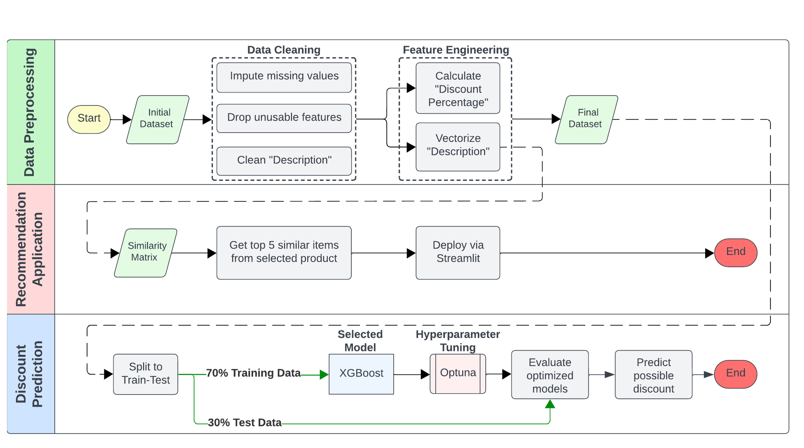
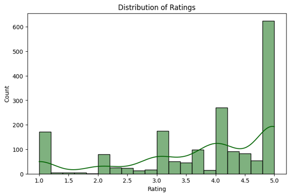

# FLIPKART Analysis and Application

This repository contains the data analysis and possible usecase (Recommendation Application and Discount Prediction) of the Flipkart Dataset.

## Table of Contents


The whole analysis and development is divided into three main sections, (1) the analysis and preprocessing of dataset, (2) development of the recommendation application, and (3) formulation of the discount prediction model.  

The details taken to perform and formulate the use-cases are presented and discussed in the following sections.
- [Data Analysis and Preprocessing](#data-analysis-and-preprocessing)
    - [Data Analysis](#data-analysis)
    - [Data Cleaning](#data-cleaning)
    - [Feature Engineering](#feature-engineering)
- [Recommendation Web Application](#recommendation-web-application)
- [Model](#model)
- [Installing Locally](#installing-locally)
- [References](#reference)


## Data Analysis and Preprocessing

### Data Analysis
Foremost, the dataset is obtained from [kaggle](https://www.kaggle.com/datasets/PromptCloudHQ/flipkart-products/data), a data science platform and online community for data scientists and machine learning practitioners under Google LLC.

As defined in the website, it is a pre-crawled dataset, taken as subset of a bigger [dataset (more than 5.8 million products)](https://www.promptcloud.com/datastock-access-ready-to-use-datasets/?utm_source=fl-kaggle&utm_medium=referral) that was created by extracting data from **Flipkart.com, a leading Indian eCommerce store**.

Features of the dataset presented in the following table:
| Feature                   | Definition                                      |
|---------------------------|------------------------------------------------|
| `product_url`             | The URL of the product on the website.         |
| `product_name`            | The name of the product.                       |
| `product_category_tree`   | The category hierarchy of the product.         |
| `pid`                     | Unique ID assigned by the website.             |
| `retail_price`            | The original price of the product.             |
| `discounted_price`        | The price after applying discounts.            |
| `image`                   | URL(s) of product images.                      |
| `is_FK_Advantage_product` | Indicates if the product has an advantage feature. |
| `description`             | Detailed description of the product.           |
| `product_rating`          | Individual rating given to the product.        |
| `overall_rating`          | Average rating based on user reviews.          |
| `brand`                   | The brand of the product.                      |
| `product_specifications`  | Technical details and specifications.          |


| Count of data with ratings | Distribution of ratings |
| -------------------------- | ----------------------- |
|  |  |

Commonly, for such dataset, a **rating model prediction** is often developed to find which optimal features such as *'what kind of description must be used for product under a certain category and retail price range in order to obtain a high rating'*. But as evident in the count of products which have obtained a rating, the amount of data may not be enough to build an optimal model. The distribution of the rating is also highly skewed and imbalanced that pushing for such model would definitely result in a bad model. 


---

### Data Cleaning
1. **Expansion of Category Tree**

    The first process done was to expand the category tree into multiple columns, with main category and limiting up to two (2) sub-categories.

2. **Dropping of Unusable Features**

    The following features are dropped for this project: 
    - The `crawl_timestamp` as this is the information during the scraping of the dataset and not the actual time it was sold at the website.
    - The `uniq_id` and `product_url` which are website specific information, tagging create by the app and do not necessarily add information to the product.

3. **Imputation of Null Values**
    
    Checking of the data, presented in the table below, showed that major features such as `retail_price`, `discounted_price`, `description`, and `brand` have some missing values for some of its instances. As this may affect the result when analaysis are performed, steps were taken to fill up these values. 

    <details close>
    <summary>Checking of Null Values</summary>

    |  feature                |  Count   |
    | ----------------------- | -------- |
    |    pid                  |      0   |
    | retail_price            |     78   |
    | discounted_price        |     78   |
    | is_FK_Advantage_product |      0   |
    | description             |      2   |
    | product_rating          |      0   |
    | overall_rating          |      0   |
    | brand                   |   5864   |
    | category_0              |     0    |
    | category_1              |    328   |
    | category_2              |   1457   |

    </details>

    (a) For data where `retail_price` and `discounted_price` are missing, the median price of products within the same main category was used. This approach was chosen because the price range varied significantly, with some extremely high values as seen in the plot below. Using the mean could have skewed the data and negatively impacted the model's performance.

    
    
    Additionally, some `category_0` such as "*INKT INKT A5 Wiro Notebook A5...*" are too specific and can actually just be considered as "Toys & School Supplies" hence for the three items with no similar category, to help impute their retail and discount prices, their `category_0` was replaced with a more common ones.

    (b) For data with missing `description`, observations showed that most product descriptions contain details from their specifications. Therefore, for instances where the description is blank, the product `specifications` were used instead. The content will be cleaned later during the preprocessing stage to prepare for tokenization.

    (c) For instances without `brand`, a value of "*Unknown*" was simply used. 

4. **Cleaning of** `description`

    Basic text preprocessing was performed to standardize the input for analysis. This included converting text to lowercase, removing special characters and extra spaces, and applying lemmatization to reduce words to their base forms. Common stopwords were also removed, except for negations like "not" and "no" to preserve meaning.

### Feature Engineering

1. **Discount Percentage**

    A simple feature, `discount_percent`, was calculated to quantify the discount offered on each product. This was computed as the percentage reduction from the retail price to the discounted price. The aim here is to let the model gains insight into pricing strategies and potential consumer appeal based on discount magnitude.

2. **TF-IDF**

    To extract meaningful insights from product descriptions, TF-IDF vectorization was applied. 

    ```
    from sklearn.feature_extraction.text import TfidfVectorizer
    
    tfidf = TfidfVectorizer(stop_words="english", max_features=500)
    tfidf_matrix = tfidf.fit_transform(dataframe['description'])
    ```
    
    TF stands for **Term Frequency** and it measures the frequency of a term (i.e., a word or a phrase) in a document. The term frequency of a term `t` in a document `d` is calculated as the number of times `t` appears in `d`, divided by the total number of terms in `d`.

    IDF stands for **Inverse Document Frequency** and it is used to determine how important a word is in a document collection. The formula for IDF is `log(N/df)` where `N` is the total number of documents in the collection, and `df` is the number of documents that contain the term.

    The TfidfVectorizer was configured to ignore common English stop words and limit the feature space to the top 500 most important words. This transformation converts **textual descriptions into numerical representations**, capturing the significance of words relative to the entire dataset. 

    **Basically, the higher the IDF score, the more important the term is in distinguishing between documents.**

## Recommendation Web Application

### Demo

The web application was deployed in the Streamlit cloud and can be accessed at [Flipkart Recommendation System](https://flipkart-analysis-and-recommendation-system.streamlit.app/). 

### Development

- To develop the recommendation system, the cosine similarity was computed to determine the similarity between products based on their descriptions. **Cosine similarity** measures how close two text vectors are, regardless of their length, and is defined as:

    <div align="center">  
    $$ \text{cosine similarity} = \frac{A \cdot B}{\|A\| \|B\|} $$  
    </div>  

    where \( A \) and \( B \) are the TF-IDF vectors of two product descriptions.  

- The square matrix where each entry `sim(i,j)` represents the cosine similarity between product `i` and product `j`. Higher values indicate greater similarity between the two products such that *a similarity score of 1 means the descriptions are identical, while a score close to 0 indicates little to no similarity*.

- The function was implemented as

    ```
    from sklearn.metrics.pairwise import cosine_similarity

    cosine_sim = cosine_similarity(tfidf_matrix, tfidf_matrix)
    ```

- Using the generated cosine similarity matrix, the **top 5 most similar products** were identified for a given product.

### Installing Locally

To run this project locally, please follow these steps:

1. Clone the repository:

   ```
   git clone https://github.com/josh-rdc/Flipkart-Analysis-and-Recommendation-System
   ```

2. Navigate to the project folder:

   ```
   cd Flipkart-Analysis-and-Recommendation-System
   ```

3. Install the required libraries:

   ```
   pip install -r requirements.txt
   ```

4. Run the application:

   ```
   streamlit run Recommendation_App.py
   ```


## Contact

If you find this work useful, kindly give a star ⭐ this repository. 

For any inquiries, feel free to contact me through the following:
 <p>
<a href="mailto:delacruz.joshua.reyes@gmail.com"></a>
<a href="https://www.linkedin.com/in/joshreyesdelacruz/" target="blank"></a>

</p>
